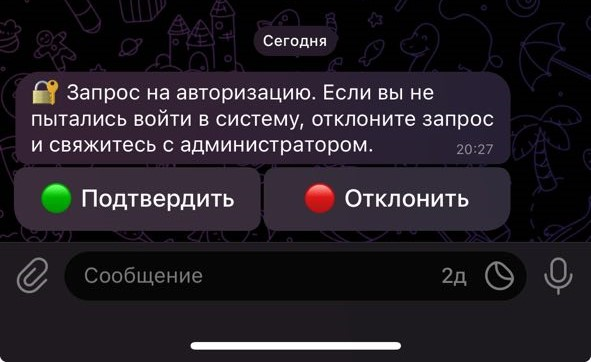
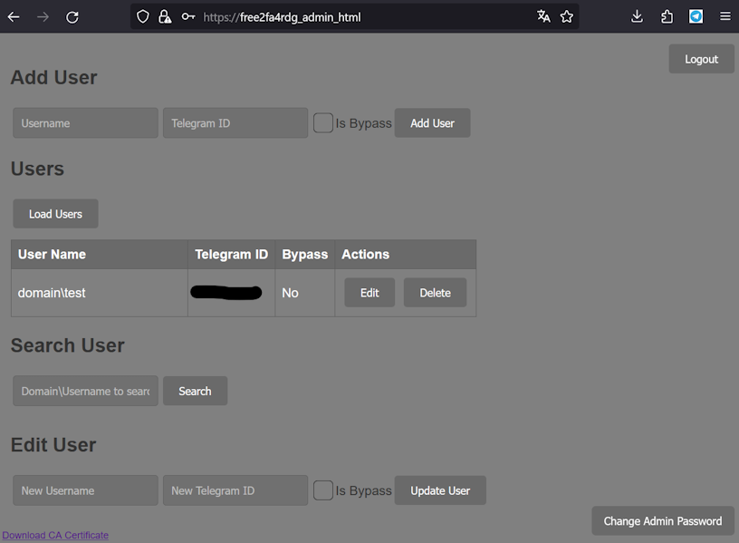

# Free2FA: Телеграм-бот для двухфакторной аутентификации

[][Docker Hub]
[][License]
[][Codacy Badge]
[][Security Rating]

[Docker Hub]:           https://hub.docker.com/r/clllagob/free2fa
[License]:              https://github.com/clllagob/free2fa/blob/master/LICENSE
[Codacy Badge]:         https://app.codacy.com/gh/CLLlAgOB/free2fa/dashboard?utm_source=gh&utm_medium=referral&utm_content=&utm_campaign=Badge_grade
[Security Rating]:  https://sonarcloud.io/summary/new_code?id=CLLlAgOB_free2fa

  

Free2FA - Это бесплатное решение которе позволяет активировать двухфакторную аутентификацию для
пользователей в домене для различных приложений, работающих с клиентом RADIUS. Для реализации
второго фактора аутентификации используется бот в Telegram, что добавляет еще один слой защиты.

## Основные компоненты

- **Free2FA**: Обрабатывает запросы на аутентификацию с помощью бота Telegram.
- **FreeRADIUS**: Система free2fa использует FreeRADIUS для проверки логина и пароля
пользователя. Если проверка прошла успешно, процесс аутентификации переходит к следующему шагу -
второму фактору безопасности, который обрабатывается free2FA (в free2FA мы не передаем пароли
пользователей, только логин). Этот компонент включает в себя сервер FreeRADIUS, который обрабатывает
запросы RADIUS от клиента и передает их в free2fa_api для обработки второго фактора аутентификации.
- **SSSD**: (System Security Services Daemon) Для интеграции с доменом AD.

FreeRADIUS и SSSD - это свободное программное обеспечение, распространяемое на условиях [GNU General
Public License version 3 (GPL-3.0)](https://www.gnu.org/licenses/gpl-3.0.en.html).  
Официальным сайт FreeRADIUS: [https://freeradius.org/](https://freeradius.org/).  
Официальный сайт SSSD: [https://sssd.io/](https://sssd.io/)  
Мы используем FreeRADIUS и SSSD без изменений в исходном коде, только с изменениями в конфигурации
для удовлетворения требований нашего проекта.

## Микросервисы Free2FA

Free2FA состоит из нескольких микросервисов, каждый из которых выполняет свою специфическую роль в
рамках системы двухфакторной аутентификации:

### 1. free2fa_setup
Сервис отвечает за начальную настройку и предварительную конфигурацию системы. Он включает в себя
генерацию и управление сертификатами, необходимыми для безопасной работы других компонентов системы.

### 2. free2fa_admin_html
Сервис предоставляет веб-интерфейс для административного управления системой.

### 3. free2fa_admin_api
Сервис API для административного интерфейса, который обеспечивает взаимодействие между веб-интерфейсом
и серверной частью системы.

### 4. free2fa_api
Основной сервис API, который обрабатывает запросы аутентификации и взаимодействует с Telegram-ботом
для подтверждения входа пользователей.

### Интеграция с доменом.

Для интеграции Linux-машины в домен и управления учетными данными используется SSSD (System Security
Services Daemon), что соответствует современным требованиям безопасности. SSSD обеспечивает поддержку
аутентификации через Kerberos, который является стандартом для безопасного обмена учетными данными в
сетевых системах. Использование Kerberos вместе с SSSD гарантирует надежную и защищенную работу с
учетными записями пользователей в домене, обеспечивая централизованное управление доступом и
аутентификацию

### Совместимость и требования к установке

Скрипт установки был успешно проверен на операционной системе Ubuntu Server 22.04 LTS.

**Описание установки:**

1. Free2FA и его компоненты распространяются в виде Docker контейнеров. Для внешнего доступа на
хосте открываются только управляющие порты: 443 для Админки и 5000 для API, оба защищены с
использованием SSL-шифрования.

2. Установка FreeRADIUS и SSSD производится автоматически на хост-машине через скрипт, а остальные
компоненты устанавливаются в Docker контейнере автоматически.

### Процесс работы системы аутентификации на примере VPN сервера Cisco AnyConnect

Этот процесс демонстрирует, как система двухфакторной аутентификации с использованием Free2FA и
FreeRADIUS интегрируется с внешними сервисами, такими как VPN сервер Cisco AnyConnect, для
обеспечения повышенной безопасности доступа пользователей.

1. **Ввод учетных данных:** Пользователь запускает клиент Cisco AnyConnect и вводит свои доменные
логин и пароль.

2. **Перенаправление запроса:** Сервер VPN Cisco AnyConnect пересылает учетные данные пользователя
на сервер FreeRADIUS для проверки.

3. **Проверка первого фактора:** FreeRADIUS анализирует полученные логин и пароль. Если данные
верны, сервер перенаправляет запрос на второй фактор аутентификации в системе Free2FA, передавая
ей только логин пользователя.

4. **Обработка второго фактора:** Free2FA сверяет логин с базой данных. В зависимости от настроек
безопасности для данного пользователя, система может отправить запрос на подтверждение входа в
приложение Telegram пользователя, пропустить запрос без дополнительного подтверждения или
заблокировать доступ.

5. **Подтверждение доступа:** Пользователь получает уведомление в Telegram и подтверждает запрос
на вход, после чего успешно подключается к VPN.

Этот механизм подтверждает, как универсально и надежно можно интегрировать двухфакторную
аутентификацию через Telegram бота в корпоративные системы безопасности. Благодаря этому, возможно
адаптировать метод к разнообразным сервисам, которые используют RADIUS для проверки подлинности.
Это обеспечивает широкие возможности для усиления защиты доступа к различным ресурсам, делая
процесс не только безопасным, но и удобным для пользователей.


## Установка

### Подготовка сервера

1. Создайте нового бота Telegram: https://core.telegram.org/bots#creating-a-new-bot.
2. Необходимо подготовить сервер на базе Ubuntu Server 22.04 LTS в минимальной комплектации,
обеспечив настройку сети и DNS. Сервер должен обладать минимум 1 ядром процессора и 1024 МБ
оперативной памяти, хотя требования к ресурсам могут возрастать в зависимости от нагрузки.
3. Создайте директорию для настроек Free2FA:
   ```
   mkdir -p /opt/2fa/ && cd /opt/2fa/
   ```
4. Запустите скрипт установки:
   ```
   curl -o install.sh https://raw.githubusercontent.com/CLLlAgOB/free2fa/main/install.sh && bash install.sh
   ```
5. Следуйте инструкциям скрипта.
6. Создайте запись днс для портала администратора (https://free2fa_admin_html по умолчанию)
либо на то имя что вы указали при  и установите в параметре ADDITIONAL_DNS_NAME_FOR_ADMIN_HTML.
Пароль и логин по умолчанию для портала администратора: admin admin.

### Настройка клиента RADIUS

1. Установите таймаут выше чем FREE2FA_TIMEOUT на 3 секунды.
2. Отключите управление паролями если есть такая опция(В данной реализации нет поддержки CHAPv2).

### Отладка

Для управления службой free2fa вы можете использовать следующие команды:
- Чтобы остановить службу free2fa, введите: service free2fa stop
- Чтобы запустить службу free2fa, введите: service free2fa start  

Для просмотра журналов Docker, следующих в директорию установки, используйте команду:  
docker compose logs -f  
Для доступа к журналам FreeRADIUS, выполните следующую команду:  
cat /var/log/freeradius/radius.log  
Чтобы запустить FreeRADIUS в режиме отладки, сначала остановите службу FreeRADIUS, выполнив:  
service freeradius stop  
Затем, чтобы запустить FreeRADIUS в режиме отладки, выполните:  
freeradius -Xx  

### Параметры конфигурации Free2fa

- `CA_EXPIRY_DAYS`: Срок действия сертификата, дней.
- `FREE2FA_TELEGRAM_BOT_TOKEN`: Токен вашего Telegram бота.
- `FREE2FA_TELEGRAM_BOT_LANGUAGE`: (ru или en) Языковая модель.
- `FREE2FA_AUTO_REG_ENABLED`: Автоматическая регистрация новых пользователей.
(Новые пользователи буду создаваться в базе автоматически с Telegram ID 0,
на портале администратора необходимо указать реальный ID)
- `FREE2FA_BYPASS_ENABLED`: (true/false) Пропуск пользователей без запроса с Telegram ID 0.
- `RADIUS_CLIENT_SECRET`: Секретная фраза для RADIUS. Рекомендую минимум 20 символов буквы в
разных регистрах цифры. Этим секретом будет шифроваться пароль перед передачей в FreeRadius.
- `FREE2FA_TIMEOUT`: Время ожидания подтверждения входа(от 10 до 20).
- `RADIUS_START_SERVERS`: Количество начальных процессов RADIUS сервера.
- `RADIUS_MAX_SERVERS`: Максимальное количество процессов RADIUS сервера.
- `RADIUS_MAX_SPARE_SERVERS`: Максимальное количество резервных процессов RADIUS сервера.
- `RADIUS_MIN_SPARE_SERVERS`: Минимальное количество резервных процессов RADIUS сервера.
- `ADMIN_SECRET_KEY`: Ключ администратора (генерируется, если оставить пустым). Используется
для безопасного доступа в админку.
- `RESET_PASSWORD`: Включение функции сброса пароля на портал администрирования
(для сброса потребуется указать ADMIN_SECRET_KEY).
- `ALLOW_API_FAILURE_PASS`: (true/false) Пускать пользователей без 2FA,
если `api.telegram.org`недоступен. 
- `ADDITIONAL_DNS_NAME_FOR_ADMIN_HTML`: ДНС имя веб сайта админки. 
Необходимо прописать его в днс или hosts для удобства доступа.
- `RADIUS_CLIENT_IP`: Ип радиус клиента. Крайне рекомендую указать с какого IP ожидать
запросы на авторизацию.


При первом входе необходимо будет сменить пароль администратора.



### Как пользователю узнать свой Telegram ID?

Пользователю необходимо зайти на бота и написать /start или нажать кнопку.
Бот в ответ пришлет сообщение с id пользователя.

### Как обновиться с предыдущей версии?

1. Перейти в каталог установки.
2. ```docker compose down``` Можно добавить -t 0 если не хотите ждать завершения.
3.  ```docker compose pull```
4.  ```docker compose up -d ```

При желании можете посмотреть логи после запуска 
```shell
docker compose logs -f
```

### История изменений:

**13.02.2024**

В базе данных логины пользователей всегда сохраняются в формате `"domain\username"`, независимо от
того, в каком формате пользователь ввел свои учетные данные.  
Это означает, что даже если пользователь использует разные способы ввода своего логина, такие как:

- `"domain\username"`
- `"domain.local\username"`
- `"username@domain.local"`
- `"username@domain"`
- `"username"` (в случае, когда разрешен вход по коротким именам без указания домена),

в базу данных будет записано единообразно: в виде `"domain\username"`. Это правило работает
одинаково для всех случаев, обеспечивая консистентность данных в базе.  

Добавлен control.sh скрипт, предоставляющий возможность настройки нескольких конфигураций на одном сервере.  

**18.02.2024**

Внесено улучшение в работу логики приложения, связанное с отсутствием подключения к API Telegram.  
Теперь, если при запуске приложения не удаётся подключиться к API Telegram, система может продолжать  
работать в обходном режиме, при условии что опция ALLOW_API_FAILURE_PASS активирована. Это означает,  
что бот будет автоматически запускаться, как только подключение к API восстановится.  
Если же после запуска бота связь снова прервётся, обходной механизм будет срабатывать, при условии  
что он включен. Кроме того, для пользователей, у которых в панели управления отмечен чекбокс Bypass,  
обходной режим будет активирован постоянно независимо от настройки ALLOW_API_FAILURE_PASS.

**01.03.2024**

Обновления Безопасности admin_html.  
В рамках усиления защиты веб-приложения, в конфигурационный файл Nginx были внесены изменения,
включающие в себя добавление ряда заголовков безопасности. Эти заголовки нацелены на:

- Улучшение безопасности соединения и обеспечение использования HTTPS.
- Предотвращение различных типов веб-атак, включая атаки через внедрение кода и подделку
межсайтовых запросов.
- Ограничение возможности встраивания контента нашего сайта во фреймы на сторонних ресурсах.
- Усиление защиты от межсайтового скриптинга (XSS) и других видов атак.

Эти меры помогают обеспечить более высокий уровень безопасности для пользователей,
предотвращая возможные угрозы и атаки.

**03.03.2024**

Проект "Free2FA" представляет две дополнительные версии приложения, разработанные для удовлетворения специфических потребностей в области безопасности. Обе версии включают в себя функциональность пуш-уведомлений через Telegram наряду с другими особенностями:

1. **Редакция для RDG (Remote Desktop Gateway)**: Эта версия предназначена для использования в системах удалённого доступа к рабочему столу через шлюзы RDG. Она предлагает дополнительный уровень защиты, интегрируя двухфакторную аутентификацию с Telegram пуш-уведомлениями. Репозиторий на GitHub: [Free2FA4RDG](https://github.com/CLLlAgOB/free2fa4rdg).

2. **Редакция с порталом и одноразовыми паролями (OTP)**: Эта версия объединяет в себе возможности аутентификации через портал с использованием одноразовых паролей и Telegram пуш-уведомлений. Она предназначена для организаций и индивидуальных пользователей, желающих использовать удобную и надёжную форму двухфакторной аутентификации. Репозиторий на GitHub: [Free2FAPlus](https://github.com/CLLlAgOB/free2faplus).

Эти редакции расширяют функциональность базовой версии "Free2FAPlus", предоставляя дополнительные опции для защиты и управления доступом к цифровым ресурсам.

**06.04.2025**  

- Предыдущая версия доступна по тегу v1.0 в docker hub.
- Обновлены компоненты и зависимости.  
- Отказ от docker-compose в пользу docker compose.
- Добавлена поддержка атрибута аутентификатора сообщений RADIUS.

**Для обновления с предыдущей версии:**
1. Бекап хоста(не обязателен но желателен).
2. Обновите конфиг клиента ```/etc/freeradius/3.0/clients.conf``` вручную добавив require_message_authenticator и limit_proxy_state = true (если ваш клиент поддерживает) в противном случае false:
```
require_message_authenticator = true
limit_proxy_state = true
```
3. Обновите FreeRadius командами: 
```shell
sudo apt update
sudo apt install --only-upgrade freeradius freeradius-common freeradius-config
```
4. в папке где лежит docker-compose.yml выполните команду под рутом:
```shell
sudo docker compose down -t 0
sudo docker compose pull
sudo docker compose up -d
sudo service freeradius restart
```